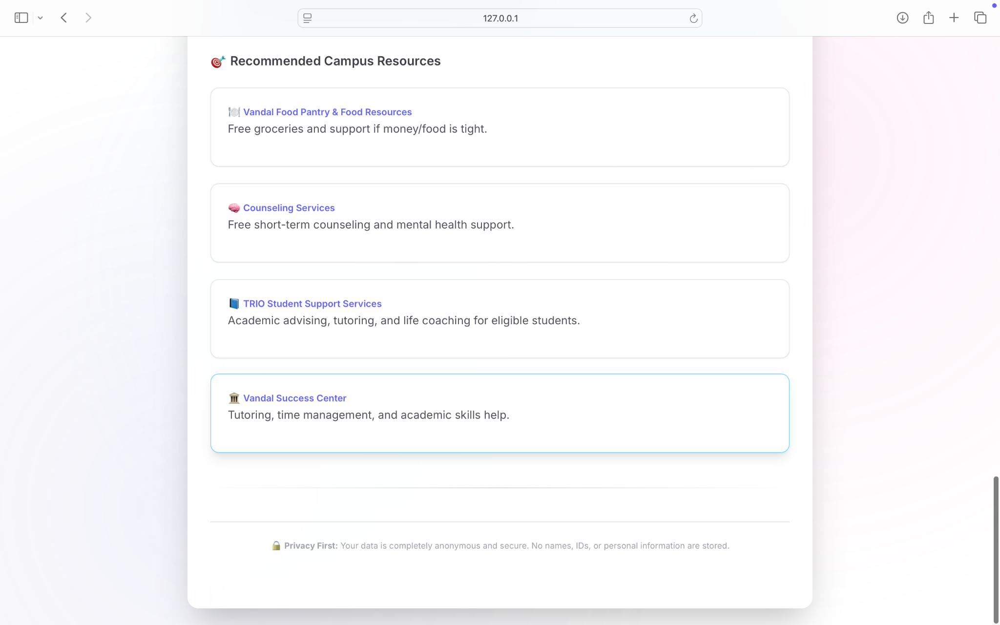

# MindGuard AI (Flask)

MindGuard is an AI-powered mental wellness web application that helps university students
identify early signs of burnout through daily check-ins, AI-driven analysis,
and personalized campus resource recommendations.

This project was developed as part of a **University of Idaho Summer Research Internship**.

> **Primary implementation:** Flask (`/flask-version`)  
> **Note:** Streamlit (`/streamlit-version`) is an earlier prototype.

---

## ✨ Features
- Daily wellness check-ins using interactive sliders
- Burnout risk classification (**Low / Moderate / High**)
- AI-generated personalized feedback from combined wellness signals
- Optional journal-based emotion analysis using **DistilBERT**
- Dynamic campus resource recommendations
- Privacy-first design (no personal data stored)
- REST API for frontend integration
- Health check endpoint for deployment monitoring

---

## 🖥️ Screenshots

### Wellness Check-In Interface


### Burnout Analysis & Feedback


### Recommended Campus Resources


---

## 🛠 Tech Stack
- **Backend:** Python, Flask, Flask-CORS
- **AI / ML:** scikit-learn, pandas, numpy, transformers, PyTorch
- **NLP Model:** DistilBERT (emotion classification)
- **Deployment Ready:** Gunicorn (Railway / Render compatible)

---

## 🚀 Quick Start (Local – Flask)

### 1. Clone the repository
```bash
git clone https://github.com/Soohann/mindguard-ai.git
cd mindguard-ai/flask-version
```

### 2. Create and activate a virtual environment
```bash
python -m venv venv
source venv/bin/activate   # Windows: venv\Scripts\activate
```

### 3. Install dependencies
```bash
pip install -r requirements.txt
```

### 4. (Optional) Enable journal emotion analysis
Emotion analysis is disabled by default for faster startup.
```bash
export USE_EMOTION=1   # Windows PowerShell: $env:USE_EMOTION="1"
```

### 5. Run the application
```bash
python app.py
```

Open in browser:
```
http://127.0.0.1:5005
```

---

## 🔌 API Endpoints
- `POST /api/submit` – Submit wellness data and receive burnout score, feedback, and resources
- `GET /api/emojis` – Emoji mapping for UI sliders
- `GET /health` – Health check endpoint

---

## ⚙️ Configuration

Optional environment variables:
```bash
USE_EMOTION=0   # Enable/disable NLP emotion analysis
PORT=5005       # Deployment platforms override this automatically
```

---

## 🧪 Notes on Performance
- When emotion analysis is enabled, the DistilBERT model downloads on first run
- For faster startup, keep `USE_EMOTION=0`

---

## 🔮 Future Improvements
- Add longitudinal trend analysis for burnout risk
- Improve emotion modeling with fine-tuned domain data
- User authentication with anonymized session tracking
- Mobile-first frontend redesign


## 👨‍💻 My Role & Contributions
- Designed and implemented the Flask web application and REST APIs
- Built wellness scoring and burnout classification logic
- Integrated optional NLP-based emotion detection using DistilBERT
- Developed personalized feedback and campus resource recommendation system
- Designed and implemented the frontend UI and user interaction flow

---

## 📄 License
MIT
